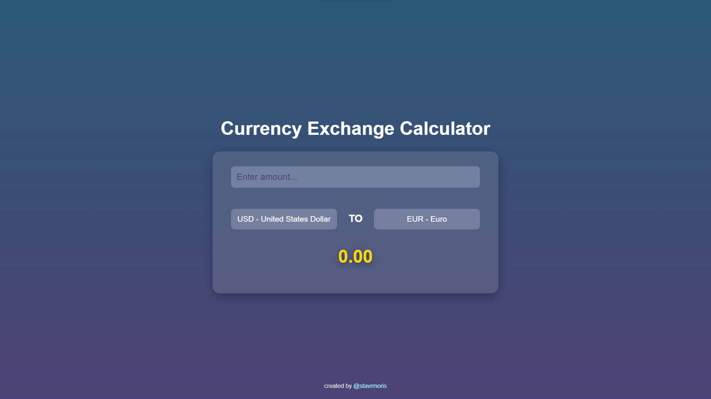

# Currency Exchange Calculator

## Description

The Currency Exchange Calculator is a simple web-based tool designed to convert amounts from one currency to another. It allows users to input an amount in one currency and get the converted value in another currency based on current exchange rates.

This project was created as a practice exercise while learning JavaScript and web development.

## Features

- Input an amount for conversion.
- Select the currency to convert from.
- Select the currency to convert to.
- Display the converted amount in the selected target currency.
